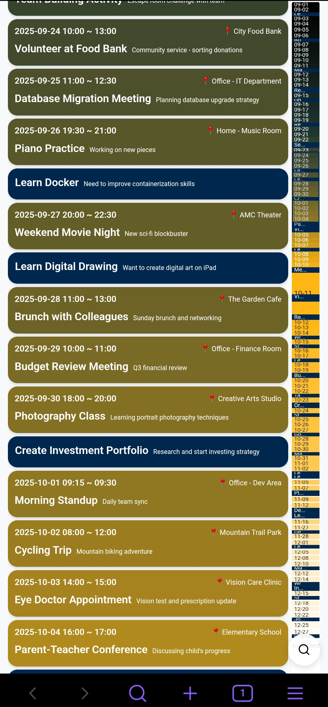

# LaC.LifeFlow Plugin

English | [简体中文](README.zh-CN.md)

Life as Code - LifeFlow is a timeline plugin to manage and display your life events in a timeline view.

## Features

### 🎯 Core Features
- **Timeline View**: Display life events and activities in chronological order
- **Event Management**: Add, edit, and delete life events
- **Time Sorting**: Automatically sort events by date and time
- **Search Function**: Quickly search and filter events
- **Location Recording**: Record the location where events occurred



### 📊 Data Format
Uses TOML format to store event data, perfectly integrated with Obsidian's Markdown files:

**Root File (lifeflow.md):**
```toml
type = "root"
renders = ["lifeflow"]

[[TestEvent1]]
[[TestEvent2]]
[[Watching Netflix]]
```

**Event File (TestEvent1.md):**
```toml
name = "Practice Coding"

[detail]
start_time = "2025-07-17 13:09"
end_time = "2025-07-17 14:21"
address = { name = "Beach" }
description = "Explored new places"
```

**Event File with Location Information:**
```toml
name = "Watching Netflix"

[detail]
start_time = "2025-10-01 14:02"
end_time = "2025-10-01 18:59"
description = "Made delicious food12"

[detail.address]
name = "Xiaomi Store (Tianyang Plaza)"
address = "Xiaomi Store, 1st Floor, Building C, Tianyang Plaza, Yanjiao"
longitude = 116.821768
latitude = 39.964811
coordinate_system = "GCJ-02"
```

### 🔧 Plugin Commands

1. **Open LaC.LifeFlow** - Open the timeline view
2. **File Context Menu** - Open Markdown files with LifeFlow

### 📁 File Structure

The plugin creates the following files in the specified folder:
- `lifeflow.md` - Root file containing the event reference list
- `TestEvent1.md` - Event file with specific event data
- `TestEvent2.md` - Event file with specific event data
- `Watching Netflix.md` - Event file with specific event data
- ... More event files

### ⚙️ Settings

- **Entry File**: Specify the file path for storing event data (default: LaC/LifeFlow/lifeflow.md)
- **Enable Context Menu**: Show "Open with LaC.LifeFlow" option in file context menu
- **Language Settings**: Interface language (auto/Chinese/English)
- **Map API Provider**: Choose map service provider (None/Amap/Google Maps)
  - **None**: Disable map features, use simple text address input
  - **Amap**: Use Amap (高德地图) service for China regions
  - **Google Maps**: Use Google Maps service for international regions
- **Amap Web Service Key**: Amap API key for address search, geocoding, and coordinate conversion
  - Get your free API key from [Amap Open Platform](https://lbs.amap.com/)
  - Required features: Web Service API (address search, geocoding)
- **Google Maps API Key**: Google Maps API key for address search, geocoding, and coordinate conversion
  - Get your free API key from [Google Open Platform](https://console.cloud.google.com/)
  - Required features: Maps JavaScript API, Places API, and Geocoding API

## Installation

### Method 1: Using BRAT (Beta Reviewers Auto-update Tester)
1. Install BRAT plugin from Community Plugins
2. Open BRAT settings
3. Click "Add Beta plugin" and enter: `alvinfunborn/lac-lifeflow`
4. Enable the plugin in Community Plugins

### Method 2: Manual Installation
1. Download the latest release from GitHub
2. Extract the files to `.obsidian/plugins/lac-lifeflow/` directory
3. Enable the plugin in Obsidian Settings

## Usage

### 1. Open Timeline
Use the command palette (Ctrl+P) and search for "Open LaC.LifeFlow". The plugin will automatically create sample data files.

### 2. Manage Events
In the timeline interface:
- **Add Event**: Click the "+" button to add a new event
- **Edit Event**: Click on an event card to edit it
- **Delete Event**: Delete events in the editing interface
- **Search Events**: Use the search box to quickly find events
- **Select Location**: Click on the address field to open the map selector and choose event location

### 3. Using Map Features
When a map provider is configured:
- **Interactive Map Selector**: Click the address field to open a full-screen map interface
- **Search Addresses**: Type to search for locations by name or address
- **Click to Select**: Click anywhere on the map to select a location
- **Auto-save Coordinates**: Longitude, latitude, and coordinate system are automatically saved
- **Coordinate Systems Support**: WGS84, GCJ-02 (China), BD-09 (Baidu)
- **Offline Access**: Once saved, location data is stored locally and works offline

### 4. Time Sorting Rules
- Events are strictly sorted by occurrence date in ascending order
- Events on the same day are sorted by time
- Events without specific times maintain their original order in the document

### 5. File Organization
- **Root File**: `lifeflow.md` contains the reference list of all events
- **Event Files**: Each event has its own `.md` file containing complete event data
- **Location Information**: Supports simple addresses and detailed coordinate information
- **Time Format**: Uses `start_time` and `end_time` fields in "YYYY-MM-DD HH:mm" format

## Technical Implementation

- Uses Obsidian Plugin API for file operations
- Supports TOML format for data storage
- React + TypeScript for building responsive UI
- Supports both mobile and desktop platforms
- Fully local storage to protect user privacy
- Integrates Amap API for address search and coordinate conversion
- Supports multilingual interface (Chinese/English)
- Distributed file storage: each event in a separate file for easier management and version control
- Supports multiple coordinate systems: WGS84, GCJ-02, BD-09

## Development

The plugin is developed based on Obsidian Plugin API. Main components:

- `LifeFlowPlugin`: Main plugin class
- `LifeFlowView`: Timeline view component
- `StoryList`: Event list component
- `StoryEditModal`: Event editing modal
- `SearchComponent`: Search component
- `MapSelector`: Map selector component
- `AddressInput`: Address input component
- `LifeFlowRepository`: Data repository class

## License

MIT License

